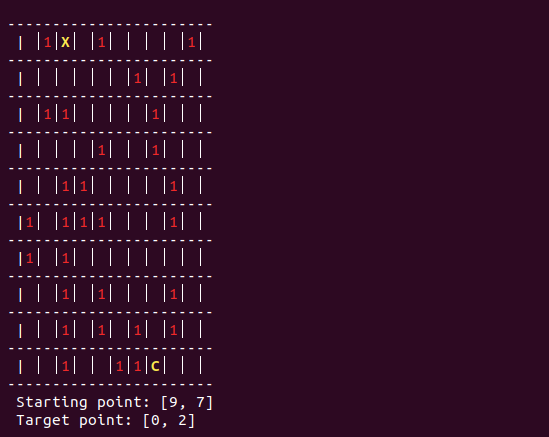
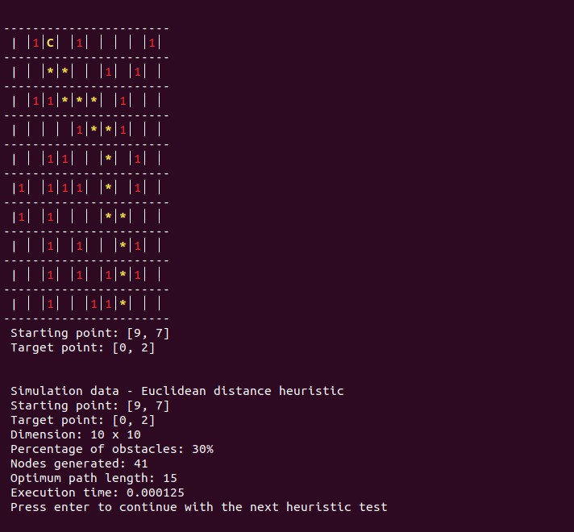
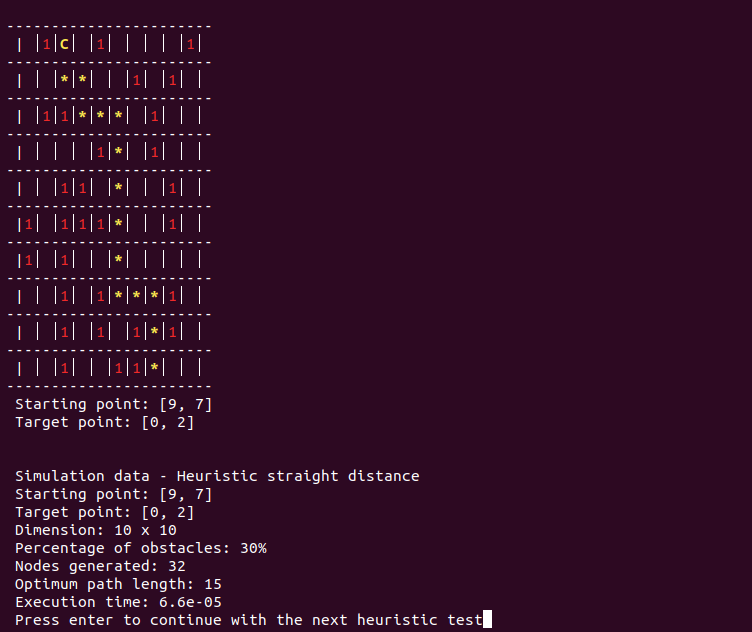

# Search-algorithms-Autonomous-car

Hi, this is my first project on Github, I hope it can help someone.

## Problem description
The aim of this project is to use search strategies as a proposed solution in the determination of trajectory planning for autonomous cars.

The environment of the autonomous car can be assumed to be rectangular with dimensions M x N and consisting of by free and occupied cells, where the car can perform movement actions, one at a time, from the current cell to one of the 4 adjacent cells (North, South, East or West) that are not in the current cell.The occupied squares correspond to obstacles. Free squares correspond to cells free of obstacles.

The car has a perception vector, consisting of the state of a proximity sensor (SN, SW, SS, SE) for each direction of movement, which detects whether the corresponding neighbour is occupied by an obstacle "1".

## Heuristic functions used
Euclidean distance: In such a two-dimensional space problem, the Euclidean distance between the origin point C and the end point X of coordinates (c1, c2) and (x1, x2) is calculated as -> ED = sqrt( (x1-c1)^2 + (x2-c2)^2 )

Rectilinear distance: In a two-dimensional space problem like this one, the rectilinear distance between two points is posed as a series of 90 degree turns joining the two points. Having the origin node C with coordinates (c1, c2) and the end node X with coordinates (x1,x2) , is calculated as -> RD = | x1 - c1 | + | x2 - c2 |

## Description of the interface and its implementation
The interface displayed by our program simulates a board with dimensions M x N which is bounded with well bounded with prominent borders and is composed of a series of squares that refer to the different positions within it. to the different positions within the board.

There are 3 main elements on the board. The first is our starting position, the car, represented by the character "C", the second the final position, represented by the character "X" and finally, the obstacles, represented by the character "1". The car moves through the board avoiding obstacles and leaving behind it the character "*", all this based on the function applied heuristics. All these elements are differentiated from each other with striking colors that facilitate their
ID.

## Operating sequence
1) A small information about the program is displayed on the screen. It is requested to press "enter" to continue.
2) The default size with which the board will be created is displayed. The user is asked if want to change it or not.
3) The user is asked if he wants to enter the position of the car manually or randomly.
4) The percentage of obstacles that will be created by default in the random option is shown. I know asks the user if they want to change it.
5) The user is informed of the number of obstacles that will be created with the previous percentage. It will asks if he wants to implement the random option or enter them manually himself, this last option allows you to enter the obstacles by keyboard or by an already predetermined file.
6) The simulations are run with both heuristics in order to compare their performance.

## Simulation example

- Initial layout of the board

- First simulation: Euclidean distance

- First simulation: Rectilinear distance

